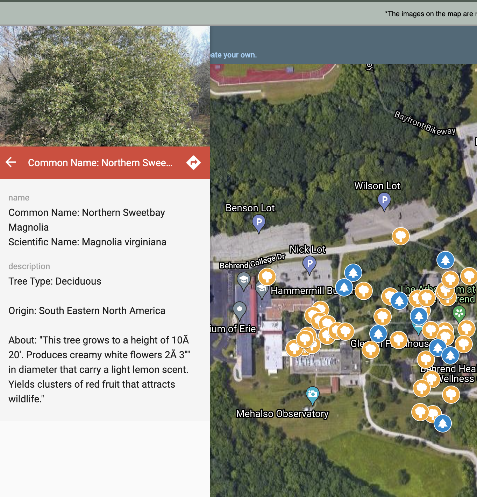

## Behrend Trees Project Review

* Site publication: <https://btrees.newtfire.org/>
* GitHub: <https://github.com/N00000DLE/BehrendTrees>
* Developers: Destinee Kellner, Grace Dill, Garrett Hess
* Date of Evaluation: 2021-12-20
* Evaluated by: @ebeshero

### Research questions
Your team set out to improve and update our campus's information about the trees in its arboretum. In the process we had re-mediated the source data as XML to make it more tractable for updating, processing, and publishing on the web. You investigated lots of data about the trees: their heights, preferred elevations, continents and regions of origin, leaf-types, and their environmental status—whether endangered or secure. 

You were meticulous in documenting and linking out to your sources, and that helps to enhance the authority of the research you're representing on this site. Well done! However, I'm not finding a Creative Commons license, a link to your code in your repo, or a description of how you designed this project with discussion of your coding and methods.

###  “UX”: User Experience and Site Interface
Gorgeous and well-designed site. The color, font, and spacing choices are well chosen for contrast and legibility, and befit the topic. Backgrounds pop, elements of the pages are well displayed. It's unusual to find a problem in this team's usually meticulous web work, but there's a broken link in the long "Navigating our Site" section on the index.html page leading to the Arboretum Articles. The link from the top navbar works, but the link lower down is broken, leading to `https://btrees.newtfire.org/arboretumArticles.html?`, and should be repaired to `https://btrees.newtfire.org/artOutput.html`.

#### Graphs, marvellous graphs!
Your team's most easily readable infographics are the small ones (easy to read on one screen without scrolling), and the interactive networks scattered throughout the site. Your graphs are always clearly labelled, and the colors are always well chosen. 

The network graphs are perhaps the ones where we learn the most about the trees most *efficiently* by clicking around and tugging at nodes. It's easy to tell which trees come from multiple regions, easy to find the odd tree that is a conifer with a "simple" leaf type. 

The long bar graphs are interesting to look through, but really call out for 
1. Sorting (I know we discussed this), or
2. Maybe another format for this data because there's so much of it!

The issue is, there are so many trees! When trying to take in information about the complex matter of what height they can reach or what elevation they prefer, a human entity of somewhere say between 3 and 6 feet tall kind of looks at the bars and numbers and thinks, "yeah, those are some tall heights or elevations or something"? What would be a better way to share this information visually? Maybe something more like your summary plots. Consider:

##### Elevation data
* What about organizing the elevation data by category: What elevation range is considered "high altitude"? What elevation is considered "sea level"? 
* How many trees are considered high altitude plants? (You can query the data for all the trees whose elevation is less than X and greater than Y, and might even plot that as a little network. 

##### Height data
* For the heights, seeing the trees sorted by shortest to tallest might make sense for that long scrolling plot.
* Or you could try clustering the information: How many trees get no larger than X "low" height? Can you see a pattern of lots of trees being of similar height ranges? What's a general average, against which to contrast your tallest and shortest trees?

#### Web Map
Garrett started exploring Leaflet JS, but it would have involved added layers of JavaScript to make the markers on your map respond as a clickable interface. It turned out that KML and Google Maps were much more tractable for web displa, and Garrett's work experimenting with the formatting of this for the web is an excellent feature on the site. That said, I'm curious about the fine-print disclaimer at the top of the map page that reads, "*The images on the map are not our own, and may not exactly represent the trees of Penn State Behrend*". That raises a couple of questions:

1. Do you mean the images of trees that appear in the sidebar on click of a tree marker? (That's worth clarifying--the position of the trees marked on the map are probably accurate, but it's the photos that aren't yours?)
2. You should mention where these images come from-. Were they from the original Behrend source photos, or supplied by Google Maps?

 One problem the project still faces is the outdated character encoding in place in the source spreadsheet documents. That should be converted to Unicode or to eliminate special characters that turn up when we pull that old source data, and it's especially visible it the map, where we have the most detailed output from that source data. Here is an example of this persistent problem:

### Arboretum Articles
Grace developed a well-designed reading view of the Behrend Beacon articles mentioning organizations involved in the arboretum. There's a separate page <https://btrees.newtfire.org/artOrganizations.html> listing the organizations as something *almost* an index, and it would be nice to see that made clickable: On click of a paragraph listed in the organization table, link directly into the article to the point of that paragraph.

### Closing Comments
Overall, your team prepared a terrific new information resource about Bherend's trees, and you gained lots of experience with re-mediating, curating, querying, and visualizing your data. Well done! 
